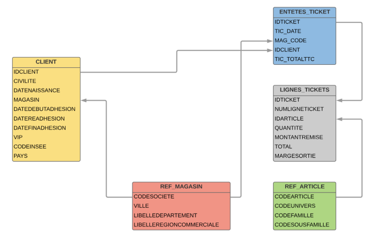

```{r global_options, include=FALSE}
knitr::opts_chunk$set(fig.width=12, fig.height=8, fig.path='Figs/',
                      echo=TRUE, warning=FALSE, message=FALSE)
```


**Objectif du projet :**

* Manipuler et analyser de la Data sous R.

* Programmer en R

* Sortir un rapport en utilisant R-Markdown


**Contexte :**
Une société X a envoyé ses données clients ainsi que ses achats sur l'année N-2 (2016) et N-1 (2017).
Le but est de sortir un rapport d’étude 

**Durée :**
Rapport et programme à retourner pour le 13 janvier 2019 au plus tard.

**Les données :**
Les tables mises à disposition sont structurées de la manière suivante :



# Enoncé

# 1 - Etude globale

## 1.1	Répartition Adhérant / VIP ....

Constituer un camembert suivant la répartition suivante :

*	*VIP* : client étant VIP (VIP = 1)

*	*NEW_N2* : client ayant adhéré au cours de l'année N-2 (date début adhésion)

*	*NEW_N1* : client ayant adhéré au cours de l'année N-1 (date début adhésion)

*	*ADHERANT* : client toujours en cours d'adhésion (date de fin d'adhésion > 2018/01/01)

*	*CHURNER* : client ayant churner (date de fin d'adhésion < 2018/01/01)


*Note : le critère le plus au-dessus est prioritaire, exemple : un client étant VIP, et ayant adhéré sur l'année N-1 sera compté comme étant VIP*

## 1.2	Comportement du CA GLOBAL par client N-2 vs N-1

Constituer une boite à moustache pour chaque année (N-2 et N-1) comparant le CA TOTAL (TTC) des clients (sommer les achats par client par années)

## 1.3	Répartition par age x sexe

Constituer un graphique montrant la répartition par age x sexe sur l'ensemble des clients.
		

# 2 -	Etude par magasin

## 2.1	Résultat par magasin (+ 1 ligne Total)

Constituer un tableau (formattable) reprenant les données suivantes :

* *MAGASIN*

* *NOMBRE DE CLIENTS RATTACHES AU MAGASIN* (avec une color_bar en fonction de la quantité)

* *NOMBRE DE CLIENTS ACTIFS sur N-2*

* *NOMBRE DE CLIENTS ACTIFS sur N-1*

* *% CLIENT N-2 vs N-1* (couleur police : vert si positif, rouge si négatif)

* *TOTAL_TTC N-2*

* *TOTAL_TTC N-1*

* *Différence entre N-2 et N-1* (couleur police : vert si positif, rouge si négatif)

* *Indice évolution *(icône de satisfaction : positif si le pourcentage de clients actifs évolue et total TTC aussi, négatif si il y a une diminution des 2 indicateurs, moyen si seulement l'un des deux diminue)

*Note --> on effectuera un tri sur l'indice d'évolution : les positifs en haut, les négatifs en bas.*

## 2.2	Distance CLIENT <-> MAGASIN

L'objectif est de calculer la distance qui existe entre le magasin et le client.

Les informations disponibles sont :

*	*la ville du magasin*

*	*le code INSEE du client*

Il faut télécharger les données GPS des villes et code-insee pour pouvoir calculer la distance :\
https://public.opendatasoft.com/explore/dataset/correspondance-code-insee-code-postal

Une fois les données acquises, il faut :

* lier les données GPS composé de la latitude et de la longitude au client et au magasin.

* constituer pour chaque client et chaque magasin 2 colonnes : latitude et longitude.

* créer une fonction qui détermine la distance entre 2 points.

La fonction doit prendre 4 variable en compte : latitude1, longitude1, latitude2, longitude2.\
Pour savoir si la fonction est correcte : http://www.lexilogos.com/calcul_distances.htm

Constituer une représentation (tableau ou graphique --> au choix) représentant le nombre de client par distance :

* *0 à 5km*

* *5 à 10km*

* *10 à 20km*

* *20 à 50km*

* *plus de 50km*

# 3 - Etude par univers

## 3.1 Evolution du CA par univers

Constituer un histogramme N-2 / N-1 affichant l'évolution du CA par univers

## 3.2	Top par univers

Afficher le top 5 des familles les plus rentable par univers (en fonction de la marge obtenu) (tableau ou graphique -> au choix)

---

# Programmation R


### Préambule

La consigne de ce projet était la création et l'utilisation de 3 fichiers :

* le fichier "Paramètres.R"

* le fichier "Projet.R"

* le fichier "Projet.Rmd"

Dans le cadre de cette exigence, nous avons mis toutes les constantes et variables du projet dans le fichier "Paramètres.R".
Nous avons aussi ajouté dans ce fichier, et comme cela l'a été demandé, les fonctions de chargement des tables.

Nous avons ensuite fait le choix de découper le projet en différentes fonctions indépendantes, de manière à faciliter l'organisation du travail en équipe. 7 fonctions ont été crées, soit 1 fonction par exercice demandé :

* repartition_adherant_vip_1.1

* comportement_CA_1.2

* proportion_sexe_age_1.3

* resultat_magasin_2.1

* distance_Client_Magasin_2.2

* etude_par_univers_3.1

* top_par_univers_3.2


Dans le même esprit, les fichiers ont été chargées sur [GitHub](https://github.com/jimilibilibob/Rproject) pour favoriser le travail en groupe.

Si vous désirez obtenir des informations supplémentaires sur chacune des fonctionnalités développées dans le code, des commentaires détaillés ont été inclus dans le code source des fichiers "Parametres.R" et "Projet.R".

### Mise en place de l'environnement de travail

Chargement du fichier paramètres qui permet :

* le chargement des biliothèques nécessaires à l'éxecutuon des scripts R de ce fichier.

* le chargement des variables des fichiers.

* le chargement des tables.

# 1 - Etude globale

Nous importons dans le fichier "Parametres.R" les différents paramètres (bases de données, variables, etc.).
C'est aussi dans ce fichier que les tables sont chargées en mémoire.

```{r Chargement_des_parametres}
source("Parametres.R")
```
Les fonctions permettant de répondre aux problématiques sont chargées dans le fichier "Projet.R"" :

```{r Chargement_des_fonctions_projet}
source("Projet.R")
```

## 1.1	Répartition Adhérant / VIP ....

La fonction qui suit permet de générer un camembert représentant la répartition des clients VIP, adhérants au cours de N-1, adhérant au cours de N-2 et les churner. Il a bien entendu fallu, dans la définition de la fonction, gérer les clients qui appartiennent à deux ensembles.

```{r Exercice_1.1_repartition_adherant_vip}
repartition_adherant_vip_1.1(ANNEE_EN_COURS,convert_date_client(clients))
```

## 1.2	Comportement du CA GLOBAL par client N-2 vs N-1

Cette fonction représente deux boites à moustache représentants les CA par clients sur l'année N-1 et N-2. Lors de la définition de cette fonction, il a fallu exclure les valeurs abérrantes qui biaisaient énormément la répartition.
```{r Exercice_1.2_comportement_CA}
comportement_CA_1.2(ANNEE_EN_COURS,entetes)
```

## 1.3	Répartition par age x sexe

INTRO 1.3
```{r Exercice_1.3_Proportion_sexe_age}
proportion_sexe_age_1.3(clients)
```

# 2 -	Etude par magasin

## 2.1	Résultat par magasin (+ 1 ligne Total)

INTRO 2.1
```{r Exercice_2.1_Resultat_magasin}
resultat_magasin_2.1(ANNEE_EN_COURS,clients, magasins, entetes)
```

## 2.2	Distance CLIENT <-> MAGASIN

#### Cette partie du projet a été divisée en 7 étapes distinctes.

**Etape 1 : Construction et préparation de la "TABLE_DE_TRAVAIL"**

Cette table est une *version aménagée et simplifiée de la table de correspondance de l'INSEE*.
Elle récupère uniquement les 4 colonnes qui nous intéressent : CODEINSEE, Code Postal, Commune et geo_point_2d.

**Etape 2 : Phase de traitement des données et rétablissement de la cohérence des données.**

Cette phase permet de rétablir la cohérence entre les tables "TABLE_DE_TRAVAIL, MAGASINS et CLIENTS

Par exemple :

* On retire tous les tirets "-" dans les nom des villes afin de ramener de la cohérence dans le champ VILLE de la "TABLE DE TRAVAIL" issue du fichier CODE INSEE et celui de la table "MAGASINS".

* On remplace tous les "ST" par "SAINT", toujours pour amener de la cohérence entre les villes de la "TABLE DE TRAVAIL" issues du fichier CODE INSEE et celle listées dans la table "MAGASINS".

* On retire le mot "CEDEX" trouvé dans certains noms de villes.

**Etape 3 : Jointure entre les tables "MAGASINS" et "TABLE DE TRAVAIL" avec mise en forme de la table nouvellement créé.**

On crée une nouvelle table "jointureGeoMagasins" avec jointure (left join) entre la table MAGASINS et la "TABLE DE TRAVAIL". Cette nouvelle table est ensuite mise en forme. Cette mise en forme inclut le renommage de certaines colonnes et l'ajout des informations manquantes de localisation dans la table MAGASINS pour la ville "LES MILLES" qui n'est pas répertoriée dans le tableau de l'INSEE.

**Etape 4 : Jointure entre les tables "CLIENTS" et "TABLE DE TRAVAIL" avec mise en forme de la table nouvellement créé.**

On crée une table "jointureGeoClients"" avec jointure (left join encore une fois) entre la table CLIENTS et la TABLE DE TRAVAIL, elle est ensuite mise en forme.

**Etape 5 : Jointure entre les tables "jointureGeoMagasins" et "jointureGeoClients".**

Cette jointure finale "jointureGeoMagasinsClients" va permettre d'effectuer le calcul de la distance entre chacun des clients de l'enseigne et le magasin dans lequel ils sont inscrits.

**Etape 6 : Calcul de la distance.**

Pour le calcul de la distance entre 2 points géographiques, on a créé la fonction **distanceGeo((lat1, lon1, lat2, lon2)**.
Cette fonction utilise la [FORMULE DE HAVERSINE](https://fr.wikipedia.org/wiki/Formule_de_haversine) en l'état.
Elle renvoie *exactement* les mêmes valeurs que celles retournées sur le site [LEXILOGOS](http://www.lexilogos.com/calcul_distances.htm).

**Etape 7 : Affichage du résultat au format tableau**

Une fois la distance calculée pour chaque client, et après que l'affectation des modalités aux distances D1 à D6 ait été effectuée, nous affichons les résultats de la table "jointureGeoMagasinsClients" dans une figure au format tableau, en utilisant la library formattable.

```{r Exercice_2.2_Distance_Client_Magasin}
distance_Client_Magasin_2.2(insee, magasins, clients)
```

# 3 - Etude par univers

## 3.1 Evolution du CA par univers
INTRO 3.1
```{r Exercice_3.1_Etude_par_univers}
etude_par_univers_3.1(articles,lignes,entetes)
```

## 3.2	Top 5 des familles les plus rentable par univers
INTRO 3.2
```{r Exercice_3.2_Top_par_univers}
top_par_univers_3.2(articles,lignes)
```
